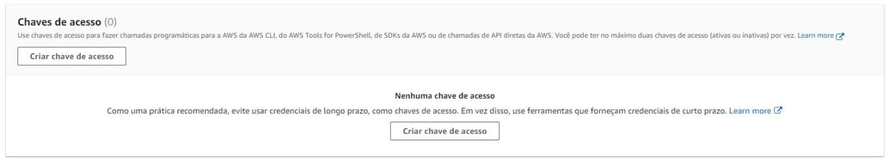

# Curso Serverless II

Esta e a API base para o projeto do curso de Serverless da Alura.

## Requisitos

Os requisitos para executar este projeto em produção são:

- Conta ativa na AWS
- WSL (para usuários Windows)
- Visual Studio Code (recomendado)

O restante da stack será instalado pelo Terraform a partir dos arquivos de configuração na raiz do próprio repositório e do repositório do projeto no DockerHub.

## Instalação

### Para usuários de Linux e MacOs

- Faça o *fork* e o *clone* do projeto para seu computador
- Navegue até a pasta-raiz do projeto

### Uso do WSL

**ATENÇÃO: Este passo só é necessário para usuários Windows.**

Se você for usuário Windows, é necessário clonar os arquivos do repositório diretamente no ambiente Linux por motivos de formato e conversão de arquivos.

> Caso seja necessário instalar o WSL pela primeira vez, temos um [artigo](https://www.alura.com.br/artigos/wsl-executar-programas-comandos-linux-no-windows) dando mais detalhes sobre esta ferramenta e como instalar.

Com o WSL instalado, siga os passos abaixo:

1. Acesse o terminal do Ubuntu/WSL;
2. Acesse a pasta `home` através do comando `cd ~`;
3. A partir da pasta `home` do ambiente Linux, você poderá criar ou selecionar subpastas usando `cd` ou `mkdir`, caso deseje organizar seus projetos;
4. Clonar o repositório do projeto no local desejado dentro do WSL, usando o comando usual `git clone <endereço do repositório>`.

### Criação de perfil e user na AWS

Antes de instalar a interface de linha de comando da AWS (aws-cli) que usaremos no curso, você precisa ter uma conta ativa na AWS. 

Os passos do processo são:

* Fazer o [cadastro na AWS](https://docs.aws.amazon.com/pt_br/cli/latest/userguide/getting-started-prereqs.html#getting-started-prereqs-signup);
* Criar uma conta IAM;
* Criar uma chave de acesso e chave secreta (*access key* e *secret key*).

Siga estes passos para criar e acessar chaves ou siga a [documentação](https://docs.aws.amazon.com/pt_br/IAM/latest/UserGuide/id_credentials_access-keys.html):

1. Após criar um usuário *root*, faça o login e acesse o console da AWS;
2. Na página principal do console, acesse o menu IAM (caso não esteja visível, procure por IAM no campo de busca de serviços na parte superior da tela);


3. Dentro da seção IAM, no menu à direita, acesse "Users";
4. Na próxima tela "Usuários", clique em "Add users"/"Adicionar usuários", no canto superior direito, para criar um novo usuário IAM;


5. Na tela "Especificar detalhes do usuário", preencha o nome do novo usuário e deixe em branco a opção de fornecer acesso ao console de gerenciamento IAM. O nome do usuário para este projeto pode ser relacionado ao curso para facilitar a identificação, como "serverless". Clique em "Próximo";


6. Na tela "add permissions"/"Definir permissões", selecionar a opção "Attach policies directly"/"Anexar políticas diretamente";
7. Na lista abaixo, selecione a opção "AdministratorAccess";


8. Confirmar clicando em "Next"/"Próximo" na parte de baixo da tela;
9. Revise as informações e clique em "Create user"/"Criar usuário";
10. Você voltará para a tela de "Users". Clique novamente no usuário recém-criado na lista e acesse o submenu "Security credentials"/"Credenciais de segurança";


11. Role a tela até a opção "Access keys"/"Chaves de acesso". Clique em "Create access key"/"Criar chaves de acesso";



12. Na próxima tela, selecione a opção "Command Line Interface (CLI)" e avance;
13. As tags são opcionais, você pode deixar em branco e clicar em "Create Access key"/"Criar chave de acesso";
14. Copie **temporariamente** para um lugar seguro as duas informações (chave de acesso e chave de acesso secreta) ou faça o download do arquivo .csv até finalizarmos a configuração do CLI.
15. Processo concluído.

A documentação da AWS tem mais informações sobre todos os passos. Neste curso utilizaremos as credenciais de longo prazo por questões de praticidade. 

- [cadastro na AWS](https://docs.aws.amazon.com/pt_br/cli/latest/userguide/getting-started-prereqs.html#getting-started-prereqs-signup).
- [criação de conta IAM](https://docs.aws.amazon.com/pt_br/cli/latest/userguide/getting-started-prereqs.html#getting-started-prereqs-iam).
- [documentação sobre chaves de acesso e seus tipos](https://docs.aws.amazon.com/pt_br/cli/latest/userguide/getting-started-prereqs.html#getting-started-prereqs-keys).

### Instalação da aws-cli

> **Usuários Windows**: Lembre-se de fazer todo o processo a partir do terminal do Ubuntu/WSL, e certifique-se que os comandos estão sendo executados a partir da pasta `home`/`~`.

Após criar o IAM e gerar as chaves, instale a interface de linha de comando da AWS. Siga as instruções [neste link](https://docs.aws.amazon.com/pt_br/cli/latest/userguide/getting-started-install.html) para instalar em seu sistema operacional.

Se não tiver certeza se já tem a CLI instalada, verifique com o comando `aws --version` no terminal. Caso esteja instalada, o terminal exibirá a mensagem `aws-cli/<versao> Python/<versao>` mais as informações sobre o seu sistema operacional. Neste curso utilizamos a versão 2.11.0.

### Configuração da aws-cli com as chaves

No mesmo terminal, insira o comando `aws configure`. Você deverá em seguida adicionar as chaves.
Copie e cole com cuidado a *Access Key ID*:
```
AWS Access Key ID [************************]: SUACHAVEAQUI
```
Em seguida, insira a *Secret Access Key*:
```
AWS Secret Access Key [************************]: SUACHAVESECRETAAQUI
```
Na opção `Default region name:` se você estiver no Brasil, insira `us-east-1`. Caso você não esteja no Brasil, deverá verificar na documentação da AWS em qual região você está.

Na opção `Default output format:` insira `json`.

> **IMPORTANTE:** Estas configurações ficam armazenadas **localmente** em seu computador. Para saber mais sobre como as credenciais funcionam e como podem ser acessadas e modificadas, acesse a [documentação da AWS](https://docs.aws.amazon.com/pt_br/cli/latest/userguide/cli-configure-files.html).

## Execução e deploy

A pasta-raiz do projeto deverá ter a seguinte estrutura:

```
.
├── env
│   └── prod
│       ├── Main.tf
├── infra
│   ├── ALB.tf
│   ├── DocDB.tf
│   ├── ECS.tf
│   ├── GrupoSeguranca.tf
│   ├── IAM.tf
│   ├── Provider.tf
│   ├── Variaveis.tf
│   └── VPC.tf
├── Desligar.sh
├── Infraestrutura.sh
└── README.md

3 directories, 14 files
```
Para executar e fazer o deploy do projeto na AWS, execute o seguinte comando no terminal:

```
./Infraestrutura.sh
```
Você deverá estar na pasta-raiz do projeto, onde está localizado o arquivo `Infraestrutura.sh`. Este script fará a instalação do Terraform, a execução dos scripts do Terraform e o deploy do projeto na AWS a partir de uma imagem Docker no DockerHub.

Após a finalização do processo, a URL base da API será exibida no terminal:

```
Outputs:

IP_alb = "curso-serverless2-api-<idDaURL>.us-east-1.elb.amazonaws.com"
```
Copie e cole a URL para ser utilizada durante o curso.
Caso seja necessário, você pode consultar a URL no console da AWS. No menu de "Services" no canto superior esquerdo, acesse EC2 > Load balancers > curso-serverless-2 > DNS Name.

> Caso você acesse o menu EC2 e não apareça nenhum Load balancer, certifique-se que a região selecionada está correta: no canto superior direito da tela do console, ao lado do nome do usuário, a região selecionada deve ser `us-east-1`.

> Importante: Para evitar cobranças desnecessárias de serviços da AWS, **mantenha a API no ar apenas enquanto estiver acompanhando o curso.** Para derrubar a API, execute o script `./Desligar.sh` na pasta-raiz do projeto.

## Acessando a URL do projeto

Este projeto expõe os seguintes endpoints:

- GET `/alunos`
- GET `/alunos/:id`
- POST `/alunos`
- PUT `/alunos/:id`
- DELETE `/alunos/:id`

### Paginação

Esta API utiliza recurso de paginação para limitar a quantidade de registros retornados via GET. O padrão é 5 registros.

Utilize o *query param* `limite=<número>` para estabelecer outros números como limite.

Exemplo:

```
http://curso-serverless2-api-<id>.us-east-1.elb.amazonaws.com/alunos?limite=50
```
